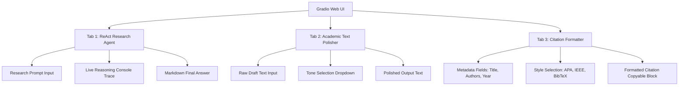

# 🔬 Hướng Dẫn Sử Dụng Giao Diện Web UI Gradio (Premium UI Guide)

Tài liệu này cung cấp hướng dẫn chi tiết về cấu trúc, tính năng và cách khởi chạy giao diện Web UI tương tác của **AI Scientific Research Assistant Agent** được phát triển bằng thư viện **Gradio**.

---

## 🌟 Tổng Quan Giao Diện

Giao diện Web UI được xây dựng theo phong cách hiện đại với chủ đề **Soft Blue & Slate**, mang lại trải nghiệm tối giản, trực quan và chuyên nghiệp (Premium Academic Aesthetics). Giao diện bao gồm 3 phân hệ chức năng chính được phân tách bằng hệ thống Tabs mượt mà.



---

## 🛠️ Chi Tiết Các Tính Năng

### 1. 🧠 Phân Hệ ReAct Research Agent
Đây là cốt lõi của Lab 3, mô phỏng chu trình suy nghĩ và hành động của Agent khoa học:
* **Mô tả hoạt động**: Người dùng nhập một yêu cầu bằng tiếng Anh (ví dụ: tìm kiếm bài báo, tóm tắt và định dạng trích dẫn). Agent sẽ tự động suy nghĩ từng bước (`Thought`), gọi công cụ học thuật tương ứng (`Action`), tiếp nhận kết quả (`Observation`), và lặp lại cho đến khi đưa ra câu trả lời cuối cùng (`Final Answer`).
* **Console Trace (Accordion)**: Một thành phần bảng điều khiển thời gian thực thu gọn/mở rộng. Toàn bộ chuỗi lập luận ReAct thô từ thiết bị đầu cuối CLI được hiển thị trực tiếp tại đây giúp người dùng và giám khảo dễ dàng theo dõi logic của Agent.
* **Gợi ý Truy vấn (Examples)**: Tích hợp sẵn 3 truy vấn khoa học mẫu ở cuối bảng nhập liệu để người dùng có thể thử nghiệm nhanh chỉ với 1 cú click.

### 2. ✍️ Công Cụ Academic Text Polisher (Biên Tập Khoa Học)
* **Mô tả hoạt động**: Giúp chuyển đổi các ghi chú thô sơ hoặc kết quả thí nghiệm viết nhanh thành các câu chữ trang trọng, chuẩn văn phong báo chí khoa học quốc tế.
* **Lựa chọn văn phong (Target Tone)**: Hỗ trợ 4 định dạng phong cách:
  * `formal academic style` (Văn phong học thuật chuẩn mực)
  * `concise conference abstract` (Tóm tắt hội thảo cô đọng)
  * `highly technical paper description` (Mô tả kỹ thuật chuyên sâu)
  * `grant proposal writing style` (Văn phong đề xuất quỹ nghiên cứu)

### 3. 📖 Bộ Định Dạng Trích Dẫn Quốc Tế (Citation Formatter)
* **Mô tả hoạt động**: Công cụ tiện ích giúp tạo nhanh tài liệu tham khảo từ các trường thông tin cơ bản của bài viết.
* **Định dạng hỗ trợ**:
  * **APA Style**: Trích dẫn dạng tác giả và năm xuất bản theo chuẩn quốc tế APA (tác giả viết tắt tên, ghi nhận họ đầy đủ).
  * **IEEE Style**: Định dạng trích dẫn dạng số thứ tự chuẩn kỹ thuật IEEE.
  * **BibTeX Code**: Xuất ra đoạn mã nguồn LaTeX/BibTeX hoàn chỉnh để người dùng copy trực tiếp vào công cụ soạn thảo như Overleaf.

---

## 🚀 Hướng Dẫn Vận Hiện Hệ Thống

### 1. Chuẩn Bị Môi Trường
Đảm bảo bạn đã điền đầy đủ thông tin khóa API trong tệp cấu hình `.env` ở thư mục gốc của dự án:
```env
OPENAI_API_KEY="sk-proj-..."
```

### 2. Khởi Chạy Ứng Dụng
Chạy lệnh Python sau từ thư mục gốc của dự án:
```bash
python app.py
```

Khi màn hình xuất hiện thông báo sau, ứng dụng đã sẵn sàng:
```bash
* Running on local URL:  http://0.0.0.0:7860
```

### 3. Truy Cập và Sử Dụng
Mở trình duyệt web của bạn và truy cập đường dẫn:
🔗 **http://localhost:7860**

---

## 🎨 Tinh Chỉnh Giao Diện (Dành Cho Nhà Phát Triển)

Trong tệp `app.py`, bạn có thể dễ dàng thay đổi giao diện theo sở thích bằng cách chỉnh sửa tham số trong phương thức `demo.launch()`:
* **Đổi Cổng Port**: Mặc định là `7860`. Bạn có thể thay đổi bằng cách sửa tham số `server_port=7860`.
* **Đổi Chủ Đề (Themes)**: Hệ thống sử dụng chủ đề premium `gr.themes.Soft(primary_hue="blue", secondary_hue="slate")`. Bạn có thể đổi sang các màu khác như `emerald`, `indigo`, `purple`, hoặc `amber`.
* **CSS Tùy Biến (Custom CSS)**: Các định dạng màu chữ gradient của tiêu đề lớn và đổ bóng cho khối được cấu hình qua chuỗi `custom_css` ở đầu tệp `app.py`.
