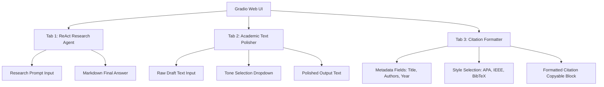

# 🔬 Hướng Dẫn Sử Dụng Giao Diện Web UI Gradio (Premium UI Guide)

Tài liệu này cung cấp hướng dẫn chi tiết về cấu trúc tối giản mới, các tính năng và cách khởi chạy giao diện Web UI tương tác của **AI Scientific Research Assistant Agent** được phát triển bằng thư viện **Gradio**.

---

## 🌟 Tổng Quan Giao Diện Mới (Tối Giản & Tập Trung)

Giao diện Web UI đã được tinh chỉnh tinh gọn và chuyên nghiệp hơn bằng cách **loại bỏ hoàn toàn Accordion xem luồng lập luận (ReAct Trace Console)**. Thay đổi này giúp người dùng tập trung hoàn toàn vào kết quả phản hồi khoa học chất lượng cao mà không bị phân tâm bởi luồng lập luận nội bộ của Agent.



---

## 🛠️ Chi Tiết Các Tính Năng & Nâng Cấp Chống Ảo Giác

### 1. 🧠 Phân Hệ ReAct Research Agent (Độ Chính Xác Tuyệt Đối)
* **Loại bỏ ảo giác (`temperature=0.0`)**: Hệ thống LLM được cấu hình với độ sáng tạo bằng `0.0`. Điều này giúp Agent hoạt động cực kỳ deterministic và thực tế, cam kết chỉ trích dẫn các bài báo thực sự được tìm thấy qua API hoặc Cơ sở dữ liệu dự phòng.
* **Bộ lọc Fallback chuẩn xác**: Khi máy chủ rate-limit (HTTP 429), công cụ sẽ chỉ tìm kiếm các bài viết khớp từ khóa trong database dự phòng. Nếu không tìm thấy, hệ thống sẽ báo cáo `"No relevant papers found..."` thay vì tự động hiển thị ngẫu nhiên các bài báo không liên quan.
* **Cấu trúc Hiển thị Định dạng Bài báo (Chuẩn hóa)**:
   Mọi bài báo tìm thấy được trình bày một cách có hệ thống bằng Tiếng Việt gồm 4 phần:
   * **Tên Paper** (Tiêu đề bài viết)
   * **Năm công bố** (Năm xuất bản thực tế)
   * **Đường dẫn** (Liên kết PDF hoặc URL bài viết thực tế)
   * **Tóm tắt** (Nội dung tóm tắt khoa học ngắn gọn bằng tiếng Việt)

### 2. ✍️ Công Cụ Academic Text Polisher (Biên Tập Khoa Học)
* Chuyển đổi các câu nháp thô sơ, sơ sài thành các đoạn văn phong học thuật, trang trọng và logic phục vụ trực tiếp cho quá trình viết bài báo khoa học.

### 3. 📖 Bộ Định Dạng Trích Dẫn Quốc Tế (Citation Formatter)
* Tạo tài liệu tham khảo nhanh chuẩn APA, IEEE hoặc mã LaTeX/BibTeX hoàn chỉnh để chèn trực tiếp vào Overleaf hoặc Word.

---

## 🚀 Hướng Dẫn Vận Hành Hệ Thống

### 1. Chuẩn Bị Môi Trường
Đảm bảo bạn đã điền khóa API trong tệp cấu hình `.env` ở thư mục gốc:
```env
OPENAI_API_KEY="sk-proj-..."
```

### 2. Khởi Chạy Ứng Dụng
```bash
python app.py
```

Khi ứng dụng chạy thành công, truy cập trình duyệt web của bạn theo đường dẫn sau để trải nghiệm:
🔗 **http://localhost:**
